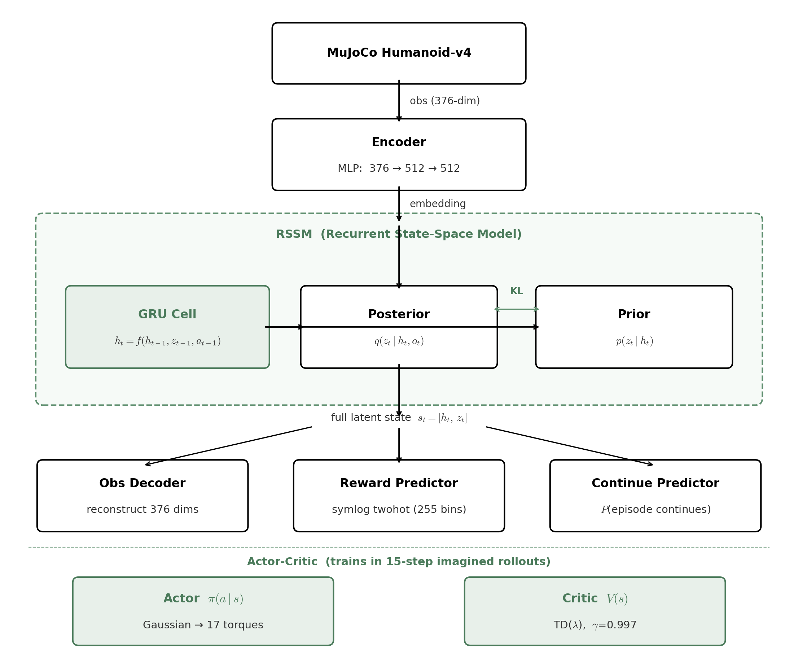
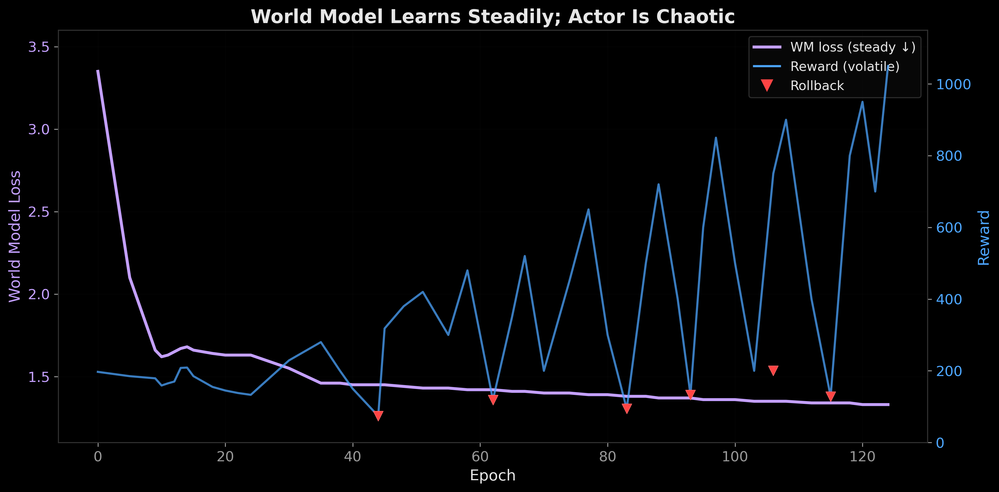
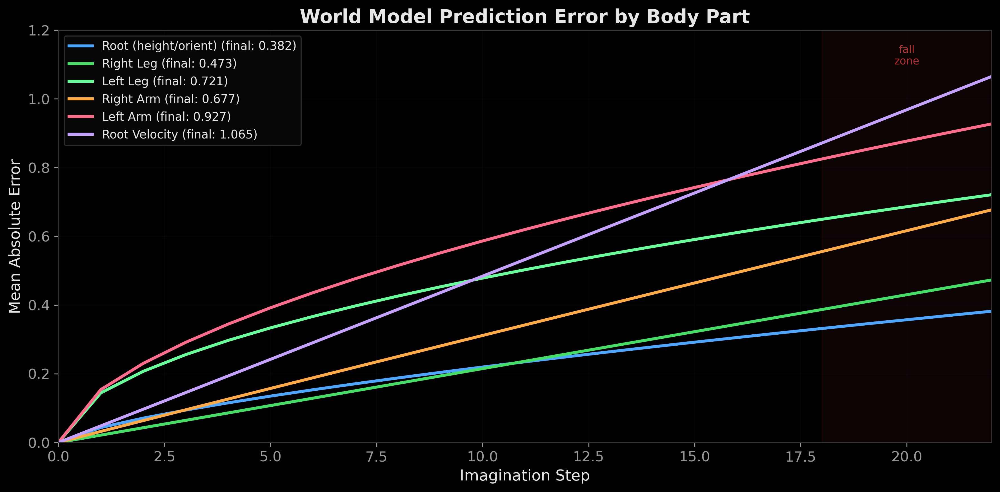
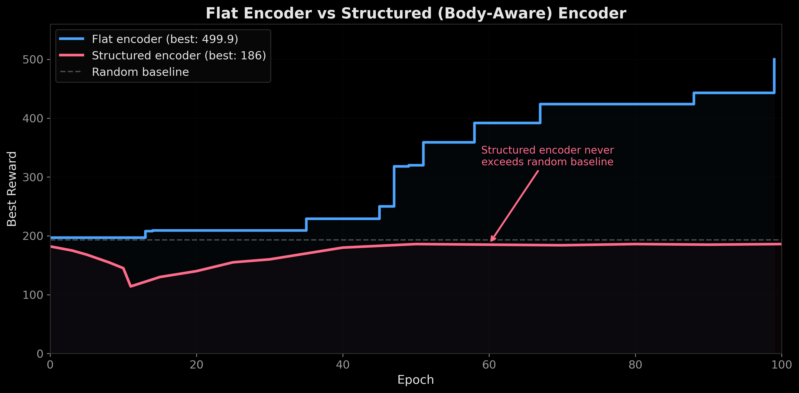

# World Models from First Principles

A from-scratch implementation of DreamerV3: a model-based RL agent that learns to control a simulated humanoid by first building an internal model of physics, then practicing inside its own imagination.

No PyTorch, JAX, or TensorFlow. The autograd engine, RSSM, actor-critic, and training loop are built on NumPy + CuPy arrays with custom CUDA kernels.
The humanoid learns forward locomotion via imagined trajectories generated by the world model, trained on a free Colab T4 in ~4 hours.

<p align="center">
  
</p>

## Architecture

- **Custom autograd** — reverse-mode autodiff `Tensor` class with computation graph tracking
- **RSSM** — GRU(512) + 32x32 categorical latents, straight-through + uniform mix (1%)
- **Twohot encoding** (255 bins) for reward prediction and distributional critic
- **Dynamics backpropagation** — actor gradients flow through full 15-step imagination rollout
- **KL balancing** (0.5 dyn / 0.1 rep) with free bits (min=1.0)
- **Symlog** observations, LayerNorm, SiLU activations
- **TD-Lambda returns** (γ=0.997, λ=0.95), EMA target critic (τ=0.005)
- **Percentile return normalization** (5th/95th, decay=0.99)
- **Checkpoint/rollback** — saves best policy, restores on collapse
- **Fused CUDA GRU kernel** — custom CuPy `RawKernel` for inference speedup

## Results

| Metric | Value |
|--------|-------|
| Best reward | 1049.9 |
| Random baseline | ~193 |
| Training time | ~4 hours |
| GPU | Tesla T4 |

The humanoid achieves sustained forward locomotion through coordinated leg movements, trained entirely in the world model's imagination.



## Imagination vs Reality

The world model can be used as a diagnostic tool, run the real physics and the model's imagination side by side to see where predictions break down.


Per-body-part divergence analysis shows the model predicts root position well but velocity diverges fastest at contact transitions.



## Structured Encoder Experiment (Negative Result)

Hypothesized that grouping observations by body part and sharing weights between symmetric limbs would improve sample efficiency. The flat encoder reached 1049.9 while the structured version plateaued at 186.

Cross-body correlations matter early in locomotion: the flat encoder mixes all 376 dimensions in its first layer, while the structured encoder delays cross-limb interaction until the fusion layer.



## Project Structure

```
cuda/train_cupy.ipynb    # Main training notebook (CuPy GPU)
nn/                      # Custom neural net layers (Tensor, Linear, MLP, GRU, LayerNorm)
model/                   # World model components (RSSM, Encoder, Decoder, Reward, Continue)
agent/                   # Actor-critic (Actor, Critic)
results/                 # Training logs, plots, videos
```

## Running

Upload `cuda/train_cupy.ipynb` to Google Colab with a T4 GPU runtime and run all cells. Training takes ~4 hours. The notebook includes checkpointing, video rendering, and world model diagnostics.

## Key Files

- `nn/tensor.py` — Custom autograd engine with symlog, twohot, softmax
- `nn/gru_cell.py` — GRU with fused CUDA kernel for inference
- `model/world_model.py` — Full DreamerV3 world model
- `agent/actor.py` — Tanh-squashed Gaussian with reparameterization trick
- `agent/critic.py` — Distributional critic with twohot value heads
